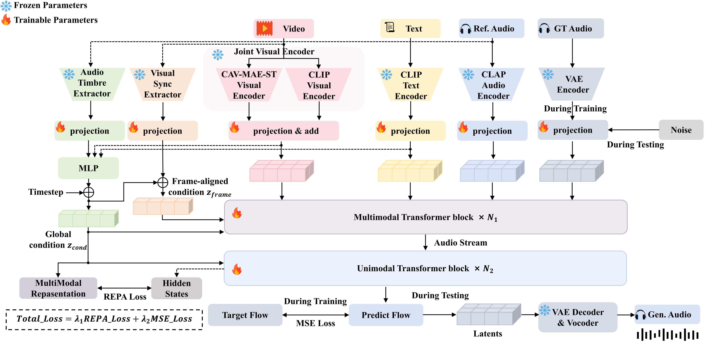
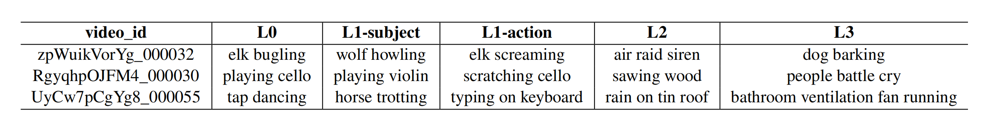
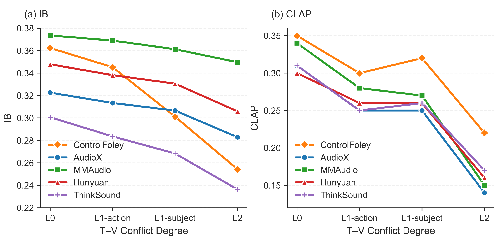

<!-- ## **ControlFoley** -->

<div align="center">

# ControlFoley: Unified and Controllable Video-to-Audio Generation with Cross-Modal Conflict Handling

<p align="center">
  <a href="xxx" style="text-decoration:none"></a>
  &nbsp;
  <a href="xxx" style="text-decoration:none"></a>
  &nbsp;
  <a href="https://yjx-research.github.io/ControlFoley_web_page/" style="text-decoration:none"></a>
  &nbsp;
  <a href="https://yjx-research.github.io/ControlFoley_demo_page/" style="text-decoration:none"></a>
  &nbsp;
  <a href="xxx" style="text-decoration:none"></a>
</p>

</div>


<div align="center">

<hr style="border: none; border-top: 3px solid #333; margin: 16px 0;">

### 👥 **Authors**

<div>
    <!-- Row 1: 5 authors -->
    <div style="margin-bottom: 2px;">
        Jianxuan Yang<sup>1*†</sup>,&nbsp;
        Xinyue Guo<sup>1*</sup>,&nbsp;
        Zhi Cheng<sup>1,2</sup>,&nbsp;
        Kai Wang<sup>1,2</sup>,&nbsp;
        Lipan Zhang<sup>1</sup>
    </div>
    <!-- Row 2: 6 authors -->
    <div>
        Jinjie Hu<sup>1</sup>,&nbsp;
        Qiang Ji<sup>1</sup>,&nbsp;
        Yihua Cao<sup>1</sup>,&nbsp;
        Mengmei Liu<sup>1</sup>,&nbsp;
        Meng Meng<sup>1</sup>,&nbsp;
        Jian Luan<sup>1</sup>
    </div>
</div>
<!-- Affiliations -->
<div>
    <sup>1</sup> MiLM Plus, Xiaomi Inc. &nbsp;&nbsp;• <sup>2</sup> Wuhan University
    <br>
    * Equal contribution &nbsp;&nbsp;• †Corresponding author
</div>
</div>

<hr style="border: none; border-top: 3px solid #333; margin: 16px 0;">

## 📰 **News**

- [2026-04] Technical report released on [arXiv](xxx).
- [2026-04] [Project page](https://yjx-research.github.io/ControlFoley_web_page/) is now live.
- [2026-04] [Inference code](xxx) and [pretrained models](xxx) are released.
- [2026-04] Online demo is available on [Project Page](https://yjx-research.github.io/ControlFoley_web_page/).
- [Coming Soon] Skill XXX will be released.

<hr style="border: none; border-top: 3px solid #333; margin: 16px 0;">

## 🔄 **Updates**

- [x] Release technical report on arXiv
- [x] Launch project page
- [x] Release inference code and pretrained models
- [x] Launch online inference demo (available on project page)
- [ ] Release skill named XXX

<hr style="border: none; border-top: 3px solid #333; margin: 16px 0;">

## 📺 **Intro Video**

https://github.com/user-attachments/assets/29ce9083-7a95-4c7d-930f-49f62dc84543

For more results, visit [Demo Page](https://yjx-research.github.io/ControlFoley_demo_page/).

<hr style="border: none; border-top: 3px solid #333; margin: 16px 0;">

## 🎧 **Overview**

ControlFoley is a unified and controllable multimodal video-to-audio (V2A) generation framework that enables precise control over generated audio using video, text, and reference audio.

Unlike existing methods that rely on a single modality or struggle under conflicting inputs, ControlFoley is designed to handle complex multimodal interactions and maintain strong controllability even when modalities are inconsistent.

<hr style="border: none; border-top: 3px solid #333; margin: 16px 0;">

## 🎨 **Tease Figure**

<div align="center">
    
    <p style="margin-top: 8px; text-align: center; font-style: italic;">
        Left: Overview of the ControlFoley framework with three multimodal conditioning modes for controllable video-synchronized audio generation. Right: Performance radar chart of Video-to-Audio models.
    </p>
</div>

<hr style="border: none; border-top: 3px solid #333; margin: 16px 0;">

## 🚀 **Capabilities**

ControlFoley supports a wide range of applications:

- 🎬 Video-to-Audio Generation (TV2A)
  Video-content-adaptive dubbing and synchronized sound effect generation under text guidance.

- 📝 Text-Controlled Audio Generation (TC-V2A)
  Audio generation under video–text conflicts, with semantics consistent with text prompts and temporally synchronized with video contents.

- 🎧 Reference-Based Audio Control (AC-V2A)
  Audio generation conditioned on reference audio, with timbre consistent with the reference audio and temporally synchronized with video contents.

- 📝 Text-to-Audio Generation (TTA)
  Generate audio directly from text prompts as an additional capability of the unified framework.

<hr style="border: none; border-top: 3px solid #333; margin: 16px 0;">

## 🧠 **Key Innovations**

<div align="center">
    
</div>

- Joint Visual Encoding for Robust Multimodal Control
  Combines CLIP and CAV-MAE-ST representations to capture both vision-language and audio-visual correlations, improving robustness under modality conflict.

- Timbre-Focused Reference Audio Control
  Extracts global timbre representations while suppressing temporal cues, enabling precise acoustic style control without affecting synchronization.

- Modality-Robust Training with Unified Alignment
  Introduces all-modality dropout and a unified REPA objective to improve robustness across diverse modality combinations.

- VGGSound-TVC Benchmark
  A new benchmark for evaluating textual controllability under visual-text semantic conflicts.

<hr style="border: none; border-top: 3px solid #333; margin: 16px 0;">

## 🧪 **VGGSound-TVC Benchmark**

We propose VGGSound-TVC to evaluate text controllability under varying levels of visual-text conflict.

- L0 → No conflict, where the textual description is consistent with the video content.
- L1_subject →  A mild semantic conflict introduced at the subject level, where the action description remains unchanged while the sounding subject is replaced.
- L1_subject → A mild semantic conflict introduced at the action level, where the subject remains unchanged while the action description is modified.
- L2 → A moderate semantic conflict in which the textual description belongs to a different semantic category while still maintaining a similar temporal structure or acoustic rhythm.
- L3 → Strong conflict, where the textual description is randomly substituted.

This enables systematic analysis of modality dominance and controllability under increasing inconsistency. Example samples from VGGSound-TVC are as follows.
<div align="center">
    
</div>

<hr style="border: none; border-top: 3px solid #333; margin: 16px 0;">

## 📊 **Performance**

ControlFoley achieves strong performance across multiple V2A tasks, demonstrating both high generation quality and robust controllability.

🎬 TV2A

ControlFoley achieves state-of-the-art performance across multiple benchmarks, including VGGSound-Test, Kling-Audio-Eval, and MovieGen-Audio-Bench.

- Highest CLAP scores (better semantic alignment)
- Lowest DeSync (better temporal synchronization)
- Best overall IS (better audio quality). Up to 27% relative improvement (22.08 vs. 17.36 on VGGSound)

<div align="center">
    
</div>

📝 TC-V2A

ControlFoley demonstrates strong textual controllability under increasing visual-text conflict.

- Maintains high CLAP (text alignment) across conflict levels  
- Effectively reduces IB under conflict (less reliance on visual bias)  
- Achieves better balance between controllability and generation quality  

<div align="center">
    
</div>

🎧 AC-V2A

ControlFoley achieves the best performance across all evaluation metrics on the Greatest Hits dataset:

- Better timbre similarity (Resemblyzer)  
- Better synchronization (DeSync)  
- Higher audio quality (IS)  
  
Notably, it outperforms CondFoleyGen, a specialized in-domain baseline, demonstrating strong generalization ability.

<div align="center">
    
</div>

##
ControlFoley also demonstrates competitive or superior performance compared to strong proprietary systems such as Kling-Foley, highlighting its effectiveness as an open and controllable solution.

<hr style="border: none; border-top: 3px solid #333; margin: 16px 0;">

## 🛠 **Quick Start**

### Prerequisites

- Python 3.10+
- PyTorch 2.5.1+
- CUDA 11.8+
- FFmpeg (conda install -c conda-forge ffmpeg)

### Installation

```bash
# Clone the repository
git clone https://github.com/ControlFoley/ControlFoley.git
cd ControlFoley

# Create conda environment
conda create -n controlfoley python=3.10.16
conda activate controlfoley

# Install dependencies
pip install -r requirements.txt

# Download pretrained weights
git clone https://huggingface.co/YJX-Xiaomi/ControlFoley ckpts
```

<hr style="border: none; border-top: 3px solid #333; margin: 16px 0;">
